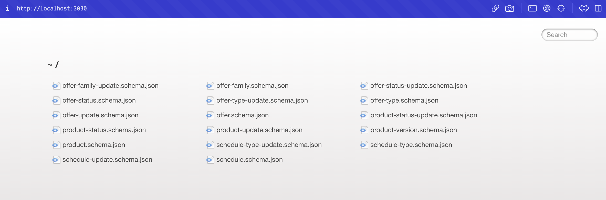
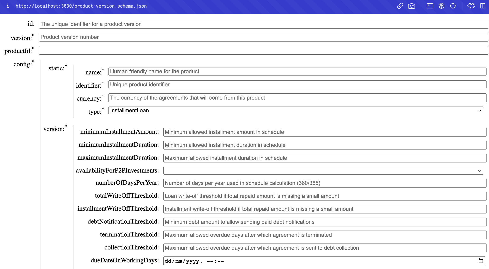

# Json-schema browser


Install:

```
git clone git@bitbucket.org:lbaccs/schema-browser.git
cd schema-browser
npm install
```


Usage:

    node schema-browser.js <PATH_TO_DIR_WITH_SCHEMAS>

Example:

    node schema-browser.js ../product/api/src/Modules/V1/Schemas


Folder view:




Schema view:



